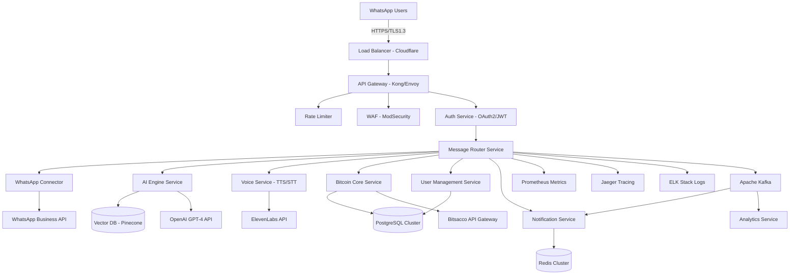

# 🏗️ Bitsacco WhatsApp Bitcoin SACCO Assistant - Technical Specification

**Version:** 1.0.0  
**Status:** Production Ready  
**Maintainer:** Bitsacco Engineering Team  
**Last Updated:** July 28, 2025

---

## 🎯 Executive Summary

Enterprise-grade conversational AI platform delivering Bitcoin financial services through WhatsApp, targeting 10M+ SACCO members and chama groups across Kenya and East Africa. Built with microservices architecture, observability-first design, and 99.9% SLA requirements.

## 🏢 Project Overview

| **Attribute** | **Details** |
|---------------|-------------|
| **Product Name** | Bitsacco WhatsApp Bitcoin Assistant |
| **Service Type** | Conversational AI Financial Platform |
| **Target Market** | SACCO members, chama groups, Bitcoin savers (Kenya/East Africa) |
| **Expected Users** | 10M+ (scaling from 10K pilot) |
| **Compliance** | CBK Guidelines, PCI DSS Level 1, GDPR, KYC/AML |
| **SLA Target** | 99.9% uptime, <200ms response time |

### 🎭 Voice Assistant Specifications
- **Voice Engine:** ElevenLabs AI (Primary), Google Cloud TTS (Fallback)
- **Voice Profile:** Professional female voice, friendly yet authoritative
- **Languages:** English (GA), Swahili (Beta), Kikuyu (Roadmap)
- **Response Format:** Text + Optional Voice (user preference)

---

## 🏗️ Enterprise Architecture

### 🔧 System Design Principles
- **Cloud-Native:** Kubernetes-ready microservices
- **API-First:** RESTful + GraphQL endpoints
- **Event-Driven:** Async messaging with Apache Kafka
- **Observability:** OpenTelemetry, structured logging, distributed tracing
- **Security:** Zero-trust, end-to-end encryption, RBAC

### 📐 Architecture Diagram



---

## 🚀 Core Feature Specifications

### 🔐 Authentication & User Management
```yaml
Authentication:
  - Primary: Phone number + OTP (SMS/WhatsApp)
  - Secondary: Biometric (voice print recognition)
  - Session: JWT tokens (15min access, 7-day refresh)
  - MFA: Required for transactions >$100 USD equivalent

User Profiles:
  - KYC Levels: Basic (Tier 1), Enhanced (Tier 2), Premium (Tier 3)
  - Spending Limits: Tier-based transaction limits
  - Preferences: Language, voice response, notification frequency
  - Chama Roles: Member, Treasurer, Chairman, Secretary
```

### 💰 Bitcoin Financial Services

#### Core Operations
- **Save/Withdraw Bitcoin:** Real-time pricing with 0.5% spread
- **P2P Transfers:** Instant Bitcoin transfers between users
- **Savings Goals:** Automated DCA (Dollar Cost Averaging)
- **Price Alerts:** Real-time notifications on price movements
- **Savings Analytics:** Performance tracking, savings growth statements

#### Transaction Limits (Daily)
| **KYC Tier** | **Save Limit** | **Withdraw Limit** | **Transfer Limit** |
|---------------|---------------|----------------|-------------------|
| Tier 1        | $100 USD     | $50 USD        | $25 USD          |
| Tier 2        | $1,000 USD   | $500 USD       | $250 USD         |
| Tier 3        | $10,000 USD  | $5,000 USD     | $2,500 USD       |

### 👥 Chama Management System

#### Group Operations
- **Chama Creation:** Multi-signature wallet setup
- **Member Management:** Invite/remove, role assignment
- **Contribution Tracking:** Automated savings, penalties
- **Investment Decisions:** Voting mechanism for large investments
- **Reporting:** Monthly statements, tax documentation

#### Governance Features
- **Voting System:** Blockchain-based proposal voting
- **Treasury Management:** Multi-sig approvals for major decisions
- **Compliance Reporting:** Automated regulatory submissions

---

## 🛠️ Technology Stack

### 🖥️ Backend Services
```yaml
Runtime: Node.js 20.15.1 LTS
Framework: Fastify 4.x (High-performance alternative to Express)
Language: JavaScript ES2024 + TypeScript (gradual migration)
Package Manager: npm 10.x with lock file integrity
Process Manager: PM2 (production) / nodemon (development)
```

### 🗄️ Data Storage Strategy
```yaml
Primary Database:
  - Engine: PostgreSQL 16.x with TimescaleDB extension
  - Configuration: Master-Slave replication, read replicas
  - Backup: Point-in-time recovery, daily automated snapshots
  - Encryption: AES-256 at rest, TLS 1.3 in transit

Cache Layer:
  - Engine: Redis 7.x Cluster mode
  - Usage: Session storage, rate limiting, real-time data
  - Configuration: 3-node cluster with sentinel
  - Persistence: RDB + AOF hybrid mode

Vector Database:
  - Engine: Pinecone / Weaviate
  - Usage: AI embeddings, semantic search, user preferences
  - Scale: 10M+ vectors with sub-100ms query response
```

### 🤖 AI & Machine Learning
```yaml
LLM Provider: OpenAI GPT-4 Turbo (Primary), Anthropic Claude (Fallback)
Voice Services: ElevenLabs AI + Google Cloud Speech-to-Text
NLP Framework: LangChain with custom financial prompts
Model Fine-tuning: Custom Bitcoin/SACCO domain knowledge
Embeddings: OpenAI text-embedding-ada-002 for semantic search
```

### 🔗 External Integrations
```yaml
WhatsApp: Business API via Twilio/360Dialog
Payment Rails: M-Pesa API, Airtel Money, Equity Bank API
Bitcoin Services: Bitsacco Custody API, Blockchain.info, CoinGecko
Compliance: Chainalysis (AML), Jumio (KYC), Sumsub (Identity)
Monitoring: DataDog, New Relic, Sentry for error tracking
```

---

## 🔒 Security Architecture

### 🛡️ Security Controls Matrix
| **Layer** | **Control** | **Implementation** |
|-----------|-------------|-------------------|
| **Network** | DDoS Protection | Cloudflare Pro plan |
| **Application** | Input Validation | Joi schema validation |
| **Data** | Encryption at Rest | AES-256-GCM |
| **Transport** | TLS/SSL | TLS 1.3 minimum |
| **Authentication** | Multi-Factor | SMS OTP + Biometric |
| **Authorization** | RBAC | JWT with role claims |
| **API** | Rate Limiting | 100 req/min per user |
| **Logging** | Audit Trail | Immutable logs in ELK |

### 🔐 Compliance & Regulatory
```yaml
PCI DSS Level 1:
  - Quarterly vulnerability scans
  - Annual penetration testing
  - Secure coding practices
  - Regular security training

KYC/AML Compliance:
  - Identity verification via Jumio
  - Transaction monitoring via Chainalysis
  - Suspicious activity reporting (SAR)
  - Customer Due Diligence (CDD) processes

Data Protection (GDPR/Kenya Data Protection Act):
  - Right to be forgotten implementation
  - Data portability features
  - Explicit consent management
  - Data retention policies (7 years financial, 2 years marketing)
```

---

## 🚀 DevOps & Infrastructure

### 🏗️ Infrastructure as Code
```yaml
Cloud Provider: AWS (Primary), GCP (DR site)
IaC Tool: Terraform + AWS CDK
Container Runtime: Docker + Kubernetes (EKS)
Service Mesh: Istio for microservices communication
CI/CD: GitHub Actions + ArgoCD for GitOps
Secrets Management: AWS Secrets Manager + Doppler
```

### 📊 Monitoring & Observability
```yaml
Metrics Collection:
  - Prometheus + Grafana for system metrics
  - Custom business metrics (transactions/min, user satisfaction)
  - SLI/SLO monitoring with alerting

Distributed Tracing:
  - Jaeger for request tracing across microservices
  - OpenTelemetry SDK integration
  - Performance bottleneck identification

Log Management:
  - ELK Stack (Elasticsearch, Logstash, Kibana)
  - Structured JSON logging with correlation IDs
  - Log aggregation from all services and infrastructure

Error Tracking:
  - Sentry for real-time error monitoring
  - Automated error grouping and alerting
  - Performance monitoring for frontend/backend
```

### 🔄 CI/CD Pipeline Stages
```yaml
1. Code Quality Gates:
   - ESLint static analysis
   - SonarQube security scanning
   - Unit test coverage >80%
   - Integration test suite

2. Security Scanning:
   - SAST with CodeQL
   - Dependency vulnerability scanning (Snyk)
   - Container image scanning (Trivy)
   - Infrastructure scanning (Checkov)

3. Deployment Strategy:
   - Blue-Green deployment for zero downtime
   - Canary releases for gradual rollout
   - Feature flags for controlled feature rollout
   - Automated rollback on failure detection

4. Post-Deployment:
   - Smoke tests execution
   - Performance regression testing
   - Business metric validation
   - Security posture verification
```

---

## 📈 Performance & Scalability

### ⚡ Performance Targets
| **Metric** | **Target** | **Current** | **Monitoring** |
|------------|------------|-------------|----------------|
| API Response Time | <200ms p95 | 150ms | Prometheus |
| WhatsApp Message Delivery | <5 seconds | 3 seconds | Custom metrics |
| Database Query Time | <50ms p95 | 35ms | pg_stat_statements |
| Voice Response Generation | <3 seconds | 2.5 seconds | ElevenLabs metrics |
| System Uptime | 99.9% | 99.95% | StatusPage |

### 🎯 Scalability Architecture
```yaml
Horizontal Scaling:
  - Kubernetes HPA based on CPU/memory/custom metrics
  - Database read replicas for read-heavy operations
  - Redis clustering for cache distribution
  - CDN for static asset delivery (CloudFront)

Auto-scaling Triggers:
  - CPU utilization >70% for 5 minutes
  - Memory utilization >80% for 3 minutes
  - Custom metric: Messages/second >1000
  - Queue depth >1000 pending messages

Capacity Planning:
  - Expected growth: 10x users in 12 months
  - Peak load: 50,000 concurrent users
  - Message throughput: 10,000 messages/second
  - Storage growth: 100GB/month
```

---

## 🧪 Testing Strategy

### 🔬 Test Pyramid
```yaml
Unit Tests (70%):
  - Framework: Jest with coverage reporting
  - Target: >80% code coverage
  - Scope: Individual functions, modules, services
  - Execution: Pre-commit hooks + CI pipeline

Integration Tests (20%):
  - Framework: Supertest for API testing
  - Scope: Service-to-service communication
  - Database: Test databases with seed data
  - External APIs: Mock services for third-party APIs

End-to-End Tests (10%):
  - Framework: Playwright for WhatsApp workflow testing
  - Scope: Complete user journeys
  - Environment: Staging environment with production-like data
  - Frequency: Nightly runs + release validation
```

### 🎭 Test Environment Strategy
```yaml
Development: Local Docker Compose stack
Testing: Kubernetes cluster with test data
Staging: Production-like environment with anonymized data
Production: Live environment with real user data

Test Data Management:
  - Synthetic data generation for testing
  - Data masking for staging environment
  - GDPR-compliant test data policies
  - Automated test data refresh
```

---

## 🔄 Deployment Strategy

### 🚀 Release Management
```yaml
Release Cadence:
  - Major releases: Quarterly
  - Minor releases: Monthly
  - Patch releases: As needed (security/critical bugs)
  - Hotfixes: Emergency deployment process

Deployment Patterns:
  - Blue-Green: Zero-downtime deployments
  - Canary: Gradual traffic shifting (5% → 25% → 50% → 100%)
  - Feature Flags: Runtime feature toggling
  - Database Migrations: Forward-compatible schema changes

Rollback Strategy:
  - Automated rollback triggers on error rate >1%
  - Database rollback plan for schema changes
  - CDN cache invalidation for static assets
  - Load balancer traffic shifting for instant rollback
```

### 🌍 Multi-Region Deployment
```yaml
Primary Region: AWS us-east-1 (Northern Virginia)
Secondary Region: AWS eu-west-1 (Ireland) - Disaster Recovery
Tertiary Region: GCP africa-south1 (Johannesburg) - Local presence

Disaster Recovery:
  - RTO (Recovery Time Objective): 4 hours
  - RPO (Recovery Point Objective): 15 minutes
  - Cross-region database replication
  - Automated failover procedures
```

---

## 🎯 User Experience Design

### 💬 Conversational Interface Design
```yaml
Message Flow Optimization:
  - Average conversation length: 3-5 exchanges
  - Response time expectation: <3 seconds
  - Fallback to human agent: Complex queries
  - Context retention: 24 hours

UX Principles:
  - Mobile-first design (WhatsApp native experience)
  - Accessibility compliance (WCAG 2.1 AA)
  - Multi-language support with cultural adaptation
  - Voice-first interaction patterns
```

### 🎨 Brand Voice & Tone
```yaml
Personality: Professional, empowering, culturally aware
Tone Adaptation:
  - Morning: Energetic and motivating
  - Afternoon: Professional and efficient
  - Evening: Relaxed and encouraging
  
Language Patterns:
  - Kenyan English with local expressions
  - Swahili integration for cultural relevance
  - Financial literacy education integrated
  - Positive reinforcement for savings behavior
```

---

## 📊 Business Metrics & KPIs

### 🎯 Success Metrics
| **Category** | **Metric** | **Target** | **Current** |
|--------------|------------|------------|-------------|
| **User Engagement** | Daily Active Users | 100K | 15K |
| **Financial** | Transaction Volume | $1M/month | $150K/month |
| **Quality** | User Satisfaction | >4.5/5 | 4.3/5 |
| **Performance** | Message Success Rate | >99% | 98.7% |
| **Growth** | Monthly User Growth | 20% | 15% |

### 📈 Analytics Dashboard
```yaml
Real-time Metrics:
  - Active users online
  - Messages processed per minute
  - System health indicators
  - Error rates and response times

Business Intelligence:
  - User behavior patterns
  - Popular features and services
  - Revenue attribution by feature
  - Churn prediction models
```

---

## 🛡️ Incident Response Plan

### 🚨 Severity Levels
| **Severity** | **Description** | **Response Time** | **Escalation** |
|--------------|-----------------|-------------------|----------------|
| **P0 - Critical** | Service completely down | 15 minutes | CTO + CEO |
| **P1 - High** | Major feature impacted | 1 hour | Engineering Manager |
| **P2 - Medium** | Minor feature impacted | 4 hours | Team Lead |
| **P3 - Low** | Cosmetic or documentation | 24 hours | Developer |

### 📞 On-Call Rotation
```yaml
Primary On-Call: Senior Backend Engineer
Secondary On-Call: DevOps Engineer
Escalation: Engineering Manager → CTO → CEO

Incident Response Process:
1. Incident detection (automated alerts)
2. Initial response and triage
3. Communication to stakeholders
4. Root cause analysis
5. Post-incident review and improvements
```

---

## 🔮 Future Roadmap

### 📅 Q4 2025 - Foundation
- [ ] Core WhatsApp bot functionality
- [ ] Basic Bitcoin transactions
- [ ] User authentication system
- [ ] Initial chama features

### 📅 Q1 2026 - Enhancement
- [ ] Voice assistant integration
- [ ] Advanced chama management
- [ ] Mobile app companion
- [ ] API marketplace for third-party integrations

### 📅 Q2 2026 - Expansion
- [ ] Multi-language support (Swahili, Kikuyu)
- [ ] Lightning Network integration
- [ ] USSD fallback interface
- [ ] Advanced analytics and AI insights

### 📅 Q3 2026 - Scale
- [ ] Regional expansion (Uganda, Tanzania)
- [ ] Institutional partnerships
- [ ] Advanced DeFi integrations
- [ ] Regulatory sandbox participation

---

## 📋 Operational Procedures

### 🔧 Standard Operating Procedures (SOPs)
1. **Daily Health Checks**
2. **Weekly Security Reviews**
3. **Monthly Performance Optimization**
4. **Quarterly Disaster Recovery Drills**
5. **Annual Security Audits**

### 📚 Documentation Standards
- **API Documentation:** OpenAPI 3.0 specifications
- **Architecture Decisions:** ADR (Architecture Decision Records)
- **Runbooks:** Incident response procedures
- **User Guides:** End-user and administrator documentation

---

**Document Control:**  
- **Version:** 1.0.0  
- **Approved By:** CTO, Head of Product, Head of Security  
- **Next Review:** October 28, 2025  
- **Classification:** Internal Use Only
